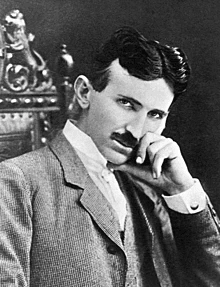

<table class="infobox biography vcard">
<tbody>
<tr>
<th colspan="2">

Nikola Tesla

</th>
</tr>
<tr>
<td colspan="2">

Никола Тесла

</td>
</tr>
<tr>
<td colspan="2">

Tesla&nbsp;<abbr title="circa">c.</abbr>&thinsp;1896

</td>
</tr>
<tr>
<th scope="row">Born</th>
<td>10 July 1856 

<a title="Smiljan" href="https://en.wikipedia.org/wiki/Smiljan">Smiljan</a>,&nbsp;<a title="Austrian Empire" href="https://en.wikipedia.org/wiki/Austrian_Empire">Austrian Empire</a>&nbsp;(modern-day&nbsp;<a title="Croatia" href="https://en.wikipedia.org/wiki/Croatia">Croatia</a>)

</td>
</tr>
<tr>
<th scope="row">Died</th>
<td>7 January 1943&nbsp;(aged&nbsp;86) 

<a title="New York City" href="https://en.wikipedia.org/wiki/New_York_City">New York City</a>,&nbsp;<a title="United States" href="https://en.wikipedia.org/wiki/United_States">United States</a>

</td>
</tr>
<tr>
<th scope="row">Resting place</th>
<td class="label"><a title="Nikola Tesla Museum" href="https://en.wikipedia.org/wiki/Nikola_Tesla_Museum">Nikola Tesla Museum</a>,&nbsp;<a title="Belgrade" href="https://en.wikipedia.org/wiki/Belgrade">Belgrade</a>,&nbsp;<a title="Serbia" href="https://en.wikipedia.org/wiki/Serbia">Serbia</a></td>
</tr>
<tr>
<th scope="row">Citizenship</th>
<td class="category">Austrian (1856&ndash;1891) American&nbsp;(1891&ndash;1943)</td>
</tr>
<tr>
<th scope="row">Education</th>
<td><a title="Graz University of Technology" href="https://en.wikipedia.org/wiki/Graz_University_of_Technology">Graz University of Technology</a>&nbsp;(dropped out)</td>
</tr>
<tr>
<td colspan="2"><strong>Engineering career</strong></td>
</tr>
<tr>
<th scope="row">Discipline</th>
<td class="category">Electrical engineering, Mechanical engineering</td>
</tr>
<tr class="note">
<th scope="row">Projects</th>
<td>

<ul>
<li><a title="Alternating current" href="https://en.wikipedia.org/wiki/Alternating_current">Alternating current</a></li>
<li>high-voltage, high-frequency power experiments</li>
</ul>

</td>
</tr>
<tr class="note">
<th scope="row">Significant design</th>
<td>

<ul class="NavContent">
<li>

<ul>
<li><a title="AC motor" href="https://en.wikipedia.org/wiki/AC_motor">AC motor</a></li>
<li><a title="Carbon button lamp" href="https://en.wikipedia.org/wiki/Carbon_button_lamp">Carbon button lamp</a></li>
<li><a title="Death ray" href="https://en.wikipedia.org/wiki/Death_ray">Death ray</a></li>
<li><a title="Induction motor" href="https://en.wikipedia.org/wiki/Induction_motor">Induction motor</a></li>
<li><a title="Plasma globe" href="https://en.wikipedia.org/wiki/Plasma_globe">Plasma globe</a></li>
<li><a title="Plasma lamp" href="https://en.wikipedia.org/wiki/Plasma_lamp">Plasma lamp</a></li>
<li><a title="Polyphase system" href="https://en.wikipedia.org/wiki/Polyphase_system">Polyphase system</a></li>
<li><a title="Radio control" href="https://en.wikipedia.org/wiki/Radio_control">Radio control</a></li>
<li><a title="Resonant inductive coupling" href="https://en.wikipedia.org/wiki/Resonant_inductive_coupling">Resonant inductive coupling</a></li>
<li><a title="Rotating magnetic field" href="https://en.wikipedia.org/wiki/Rotating_magnetic_field">Rotating magnetic field</a></li>
<li><a title="Teleforce" href="https://en.wikipedia.org/wiki/Teleforce">Teleforce</a></li>
<li><a title="Telegeodynamics" href="https://en.wikipedia.org/wiki/Telegeodynamics">Telegeodynamics</a></li>
<li><a title="Teleoperation" href="https://en.wikipedia.org/wiki/Teleoperation">Teleoperation</a></li>
<li><a title="Tesla coil" href="https://en.wikipedia.org/wiki/Tesla_coil">Tesla coil</a></li>
<li><a title="Tesla Experimental Station" href="https://en.wikipedia.org/wiki/Tesla_Experimental_Station">Tesla Experimental Station</a></li>
<li><a title="Tesla's oscillator" href="https://en.wikipedia.org/wiki/Tesla%27s_oscillator">Tesla's oscillator</a></li>
<li><a title="Tesla turbine" href="https://en.wikipedia.org/wiki/Tesla_turbine">Tesla turbine</a></li>
<li><a title="Tesla valve" href="https://en.wikipedia.org/wiki/Tesla_valve">Tesla valve</a></li>
<li><a title="Torpedo" href="https://en.wikipedia.org/wiki/Torpedo">Torpedo</a></li>
<li><a title="Vacuum variable capacitor" href="https://en.wikipedia.org/wiki/Vacuum_variable_capacitor">Vacuum variable capacitor</a></li>
<li><a title="Violet ray" href="https://en.wikipedia.org/wiki/Violet_ray">Violet ray</a></li>
<li><a title="VTOL" href="https://en.wikipedia.org/wiki/VTOL">VTOL</a></li>
<li><a title="Wardenclyffe Tower" href="https://en.wikipedia.org/wiki/Wardenclyffe_Tower">Wardenclyffe Tower</a></li>
<li><a title="Wireless power transfer" href="https://en.wikipedia.org/wiki/Wireless_power_transfer">Wireless power transfer</a></li>
<li><a title="World Wireless System" href="https://en.wikipedia.org/wiki/World_Wireless_System">World Wireless System</a></li>
</ul>

</li>
</ul>

</td>
</tr>
<tr>
<th scope="row">Awards</th>
<td>

<ul class="NavContent">
<li>

<ul>
<li><a title="Order of St. Sava" href="https://en.wikipedia.org/wiki/Order_of_St._Sava">Order of St. Sava</a>, II Class, Government of Serbia (1892)</li>
<li><a title="Elliott Cresson Medal" href="https://en.wikipedia.org/wiki/Elliott_Cresson_Medal">Elliott Cresson Medal</a>&nbsp;(1894)</li>
<li><a title="Order of Prince Danilo I" href="https://en.wikipedia.org/wiki/Order_of_Prince_Danilo_I">Order of Prince Danilo I</a>&nbsp;(1895)</li>
<li><a class="mw-redirect" title="Edison Medal" href="https://en.wikipedia.org/wiki/Edison_Medal">Edison Medal</a>&nbsp;(1916)</li>
<li><a title="Order of St. Sava" href="https://en.wikipedia.org/wiki/Order_of_St._Sava">Order of St. Sava</a>, I Class, Government of Yugoslavia (1926)</li>
<li><a title="Order of the Yugoslav Crown" href="https://en.wikipedia.org/wiki/Order_of_the_Yugoslav_Crown">Order of the Yugoslav Crown</a>&nbsp;(1931)</li>
<li><a title="John Scott Medal" href="https://en.wikipedia.org/wiki/John_Scott_Medal">John Scott Medal</a>&nbsp;(1934)</li>
<li><a title="Order of the White Eagle (Serbia)" href="https://en.wikipedia.org/wiki/Order_of_the_White_Eagle_(Serbia)">Order of the White Eagle</a>, I Class, Government of Yugoslavia (1936)</li>
<li><a title="Order of the White Lion" href="https://en.wikipedia.org/wiki/Order_of_the_White_Lion">Order of the White Lion</a>, I Class, Government of Czechoslovakia (1937)</li>
<li>University of Paris Medal (1937)</li>
<li>The Medal of the University St Clement of Ochrida,&nbsp;<a class="mw-redirect" title="Sofia, Bulgaria" href="https://en.wikipedia.org/wiki/Sofia,_Bulgaria">Sofia, Bulgaria</a>&nbsp;(1939)</li>
</ul>

</li>
</ul>

</td>
</tr>
<tr>
<th colspan="2">Signature</th>
</tr>
<tr>
<td colspan="2"></td>
</tr>
</tbody>
</table>
 

<strong>Nikola Tesla</strong>&nbsp;(<a title="Help:IPA/English" href="https://en.wikipedia.org/wiki/Help:IPA/English">/ˈtɛslə/</a>;&nbsp;<a title="Serbian Cyrillic alphabet" href="https://en.wikipedia.org/wiki/Serbian_Cyrillic_alphabet">Serbian Cyrillic</a>:&nbsp;Никола Тесла;&nbsp;<small>pronounced&nbsp;</small><a title="Help:IPA/Serbo-Croatian" href="https://en.wikipedia.org/wiki/Help:IPA/Serbo-Croatian">[nǐkola t&ecirc;sla]</a>;&nbsp;10 July 1856&nbsp;&ndash; 7 January 1943) was a&nbsp;<a class="mw-redirect" title="Serbian-American" href="https://en.wikipedia.org/wiki/Serbian-American">Serbian-American</a>&nbsp;<a title="Inventor" href="https://en.wikipedia.org/wiki/Inventor">inventor</a>,&nbsp;<a class="mw-redirect" title="Electrical engineer" href="https://en.wikipedia.org/wiki/Electrical_engineer">electrical engineer</a>,&nbsp;<a title="Mechanical engineering" href="https://en.wikipedia.org/wiki/Mechanical_engineering">mechanical engineer</a>, and&nbsp;<a title="Futurist" href="https://en.wikipedia.org/wiki/Futurist">futurist</a>&nbsp;who is best known for his contributions to the design of the modern&nbsp;<a title="Alternating current" href="https://en.wikipedia.org/wiki/Alternating_current">alternating current</a>&nbsp;(AC)&nbsp;<a class="mw-redirect" title="Electricity supply" href="https://en.wikipedia.org/wiki/Electricity_supply">electricity supply</a>&nbsp;system.

Born and raised in the Austrian Empire, Tesla studied engineering and physics in the 1870s without receiving a degree, and gained practical experience in the early 1880s working in&nbsp;<a title="Telephony" href="https://en.wikipedia.org/wiki/Telephony">telephony</a>&nbsp;and at Continental Edison in the new&nbsp;<a title="Electric power industry" href="https://en.wikipedia.org/wiki/Electric_power_industry">electric power industry</a>. In 1884 he emigrated to the United States, where he became a naturalized citizen. He worked for a short time at the&nbsp;<a title="Edison Machine Works" href="https://en.wikipedia.org/wiki/Edison_Machine_Works">Edison Machine Works</a>&nbsp;in New York City before he struck out on his own. With the help of partners to finance and market his ideas, Tesla set up laboratories and companies in New York to develop a range of electrical and mechanical devices. His&nbsp;<a title="Alternating current" href="https://en.wikipedia.org/wiki/Alternating_current">alternating current</a>&nbsp;(AC)&nbsp;<a title="Induction motor" href="https://en.wikipedia.org/wiki/Induction_motor">induction motor</a>&nbsp;and related&nbsp;<a title="Polyphase system" href="https://en.wikipedia.org/wiki/Polyphase_system">polyphase</a>&nbsp;AC patents, licensed by&nbsp;<a title="Westinghouse Electric Corporation" href="https://en.wikipedia.org/wiki/Westinghouse_Electric_Corporation">Westinghouse Electric</a>&nbsp;in 1888, earned him a considerable amount of money and became the cornerstone of the polyphase system which that company eventually marketed.

Attempting to develop inventions he could patent and market, Tesla conducted a range of experiments with mechanical oscillators/generators, electrical discharge tubes, and early X-ray imaging. He also built a wireless-controlled boat, one of the first ever exhibited. Tesla became well known as an inventor and demonstrated his achievements to celebrities and wealthy patrons at his lab, and was noted for his showmanship at public lectures. Throughout the 1890s, Tesla pursued his ideas for wireless lighting and worldwide wireless electric power distribution in his high-voltage, high-frequency power experiments in New York and&nbsp;<a title="Colorado Springs, Colorado" href="https://en.wikipedia.org/wiki/Colorado_Springs,_Colorado">Colorado Springs</a>. In 1893, he made pronouncements on the possibility of&nbsp;<a class="mw-redirect" title="Wireless communication" href="https://en.wikipedia.org/wiki/Wireless_communication">wireless communication</a>&nbsp;with his devices. Tesla tried to put these ideas to practical use in his unfinished&nbsp;<a title="" href="https://en.wikipedia.org/wiki/Wardenclyffe_Tower">Wardenclyffe Tower</a>&nbsp;project, an intercontinental wireless communication and power transmitter, but ran out of funding before he could complete it.

After Wardenclyffe, Tesla experimented with a series of inventions in the 1910s and 1920s with varying degrees of success. Having spent most of his money, Tesla lived in a series of New York hotels, leaving behind unpaid bills. He died in New York City in January 1943.&nbsp;Tesla's work fell into relative obscurity following his death, until 1960, when the&nbsp;<a title="General Conference on Weights and Measures" href="https://en.wikipedia.org/wiki/General_Conference_on_Weights_and_Measures">General Conference on Weights and Measures</a>&nbsp;named the&nbsp;<a class="mw-redirect" title="SI unit" href="https://en.wikipedia.org/wiki/SI_unit">SI unit</a>&nbsp;of&nbsp;<a class="mw-redirect" title="Magnetic flux density" href="https://en.wikipedia.org/wiki/Magnetic_flux_density">magnetic flux density</a>&nbsp;the&nbsp;<a title="Tesla (unit)" href="https://en.wikipedia.org/wiki/Tesla_(unit)">tesla</a>&nbsp;in his honor.&nbsp;There has been a resurgence in popular interest in Tesla since the 1990s.

 

<h2> Publications </h2>

<ul>
 <li><a target="_blank" href="https://github.com/manjunath5496/Nikola-Tesla-writings/blob/master/tesla(1).pdf" style="text-decoration:none;">The True Wireless</a></li>
  
<li><a target="_blank" href="https://github.com/manjunath5496/Nikola-Tesla-writings/blob/master/tesla(2).pdf" style="text-decoration:none;">The Fantastic Inventions of Nikola Tesla</a></li>

<li><a target="_blank" href="https://github.com/manjunath5496/Nikola-Tesla-writings/blob/master/tesla(3).pdf" style="text-decoration:none;">My Inventions: Nikola Tesla's Autobiography</a></li>
  
<li><a target="_blank" href="https://github.com/manjunath5496/Nikola-Tesla-writings/blob/master/tesla(4).pdf" style="text-decoration:none;"> Experiments with Alternate Currents of High Potential and High Frequency</a></li>
                               
  <li><a target="_blank" href="https://github.com/manjunath5496/Nikola-Tesla-writings/blob/master/tesla(5).pdf" style="text-decoration:none;"> The Problem of Increasing Human Energy </a></li>   

 <li><a target="_blank" href="https://github.com/manjunath5496/Nikola-Tesla-writings/blob/master/tesla(6).pdf" style="text-decoration:none;">Nikola Tesla: Complete Articles and Patents</a></li>
                <li><a target="_blank" href="https://github.com/manjunath5496/Nikola-Tesla-writings/blob/master/tesla(7).pdf" style="text-decoration:none;">Nikola Tesla: Lecture Before the New York Academy of Sciences April 6, 1897</a></li> 
                
   <li><a target="_blank" href="https://github.com/manjunath5496/Nikola-Tesla-writings/blob/master/tesla(8).pdf" style="text-decoration:none;">Nikola Tesla Colorado Springs Notes 1899&minus;1900: Part I</a></li>
                <li><a target="_blank" href="https://github.com/manjunath5496/Nikola-Tesla-writings/blob/master/tesla(9).pdf" style="text-decoration:none;">Nikola Tesla Colorado Springs Notes 1899&minus;1900: Part II</a></li>               
                
                

</ul>
